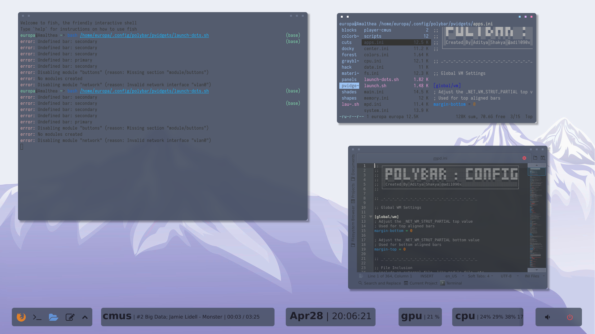

# baph's dotfiles 
## for people who are, you know
### into *that*

  
  

First distribution of my dotfiles, hope you enjoy!

  
  

  
  
  
  
  
  
  
  
  
  
  
  

## changelog

Version 1.0, will need some modifying of paths

  

GPL'd, mod away :)

  
  
  
  

## requirements
* Openbox [ ]
  
* Polybar [ ]
  
* Rofi (I assume, expect an update when I actually get to installing it) [ ]
  
* Pywal [ ]
  
* Ranger [ ]
  
* Neofetch [ ]
  
* Picom (I use Jonaburg's fork) [ ]
  

  
  

## how-to
1. Install dependencies, restart, reinstall graphics drivers when needed (eg when your computer won't start the xserver).
2. yet-another-obt-master (by owl4ce!) may be needed for color-scheme and window frames. Either way, thanks owl!
3. Put the dot-folders into .config, overwrite files if needed, change paths of scripts, enjoy!

  
  

## thanks 
* Owl4CE (aformentioned obt's, plus more dotfiles!)
* adi1090x (the pwidgets polybar theme this is based on)
* jonaburg (Rounded Corners Picom that doesn't eat RAM)

  
  
  
  
  
  

btw, rightclicking power-button will toggle picom
